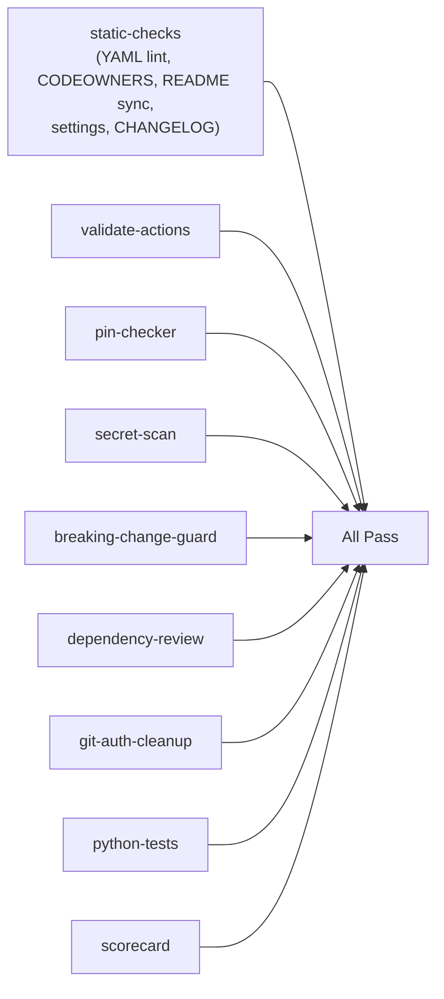
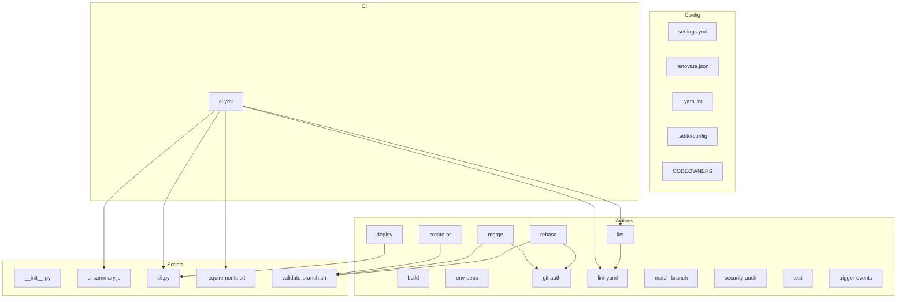

# Architecture

Overview of the CyberSkill `.github` organization repository — design decisions, directory layout, and integration patterns.

## Directory Layout

```
.github/                    # GitHub-specific files (workflows, templates)
  workflows/ci.yml          # CI pipeline validating this repo itself
  ISSUE_TEMPLATE/           # Bug report + feature request forms
  PULL_REQUEST_TEMPLATE.md  # PR template for contributors
actions/                    # Reusable composite actions (the main product)
  git-auth/                 # Shared git identity + token auth setup
  env-deps/                 # Node.js + pnpm + .env setup
  build/                    # Build + optional artifact upload
  lint/                     # YAML lint + pnpm lint
  lint-yaml/                # Standalone yamllint
  test/                     # Test runner + coverage thresholds
  security-audit/           # pnpm audit with JSON reporting
  deploy/                   # SSH deploy with health check + rollback
  create-pr/                # Idempotent PR creation via gh CLI
  merge/                    # Branch merge with strategy selection
  rebase/                   # Branch rebase with dry-run support
  match-branch/             # Branch name matching utility
  trigger-events/           # Concurrent repository_dispatch firing
scripts/                    # Python/bash utilities for CI
  cli.py                    # Unified CLI (lint-all, generate, deploy, release)
  validate-branch.sh        # Shared branch name validation (sourced by actions)
  requirements.txt          # Hash-pinned Python dependencies
  lib/                      # CLI handler modules
    deploy.py               # Deployment logic (validation, rollback, health check)
    generators.py           # Mermaid graph + action docs generation
    helpers.sh              # Shared bash functions (trim, split_csv, retry)
    linters.py              # Static validation checks
    release.py              # Release workflow (changelog, tag, push)
  tests/                    # pytest tests for CLI
docs/                       # Community health files
settings.yml                # Org-wide tag protection rulesets
renovate.json               # Automated dependency updates
CODEOWNERS                  # Review assignment rules
```

## Design Principles

### Composite Actions over Reusable Workflows

All shared CI steps are **composite actions** (`using: "composite"`), not reusable workflows. This allows consumers to compose them freely within their own jobs, unlike reusable workflows which impose a full job boundary.

### Rolling Release on `@main`

Actions are consumed via `@main` — no versioned tags for actions. This means:
- Changes to `main` propagate immediately to all org repos
- Breaking changes require coordination (see [CONTRIBUTING.md — Releasing](CONTRIBUTING.md#releasing))
- The `breaking-change-guard` CI job detects removed/added required inputs automatically

### SHA Pinning for External Dependencies

All external `uses:` references are pinned to full 40-character commit SHAs (not floating tags). The `pin-checker` CI job enforces this. Internal references to `cyberskill-official/.github/` use `@main` since SHA-pinning the same repo is impractical.


### Shared Git Auth via `git-auth` Action

The `merge` and `rebase` actions share identical git identity/auth logic extracted into `actions/git-auth`. This composite action sets up `github-actions[bot]` identity and configures URL-embedded token auth. Callers add their own `if: always()` cleanup step to remove the token from the remote URL after use.

## CI Pipeline

The CI workflow (`ci.yml`) runs multiple independent jobs on PRs to `main` (excluding paths matched by its `paths-ignore` filters, with `workflow_dispatch` for manual reruns):



The main validation jobs have no `needs:` dependencies — maximum parallelism. Each job checks out independently for isolation. The `ci-summary` job (not shown) depends on all other jobs via `needs:` and runs `if: always()` to post a consolidated status table comment on PRs.

## Integration Pattern for Consumers

A typical consumer workflow:

```yaml
jobs:
  ci:
    runs-on: ubuntu-latest
    steps:
      - uses: actions/checkout@<sha>
      - uses: cyberskill-official/.github/actions/env-deps@main
      - uses: cyberskill-official/.github/actions/security-audit@main
      - uses: cyberskill-official/.github/actions/lint@main
      - uses: cyberskill-official/.github/actions/test@main
      - uses: cyberskill-official/.github/actions/build@main
```

The `env-deps` action must always run first (sets up Node.js, pnpm, dependencies). Other actions can run in any order after that.

### Multi-Package-Manager Support

The `env-deps` action auto-detects the project's package manager (pnpm, npm, yarn) from lockfiles and exports `PM_RUN` and `PM_INSTALL` environment variables. The `build`, `lint`, and `test` actions use `${{ env.PM_RUN }} --if-present <script>` — they work with any supported package manager without modification.

- `env-deps` must run first in any workflow using these actions (it sets the env vars)
- Default is `pnpm` when no lockfile is detected (most CyberSkill repos use pnpm)
- The `deploy` action supports configurable `BUILD_COMMAND`/`RELOAD_COMMAND` because it runs on remote servers where the package manager is environment-specific

## Dependency Map

<!-- START MERMAID -->

<!-- END MERMAID -->

## Shared Patterns

| Pattern | Used By | Location |
|---------|---------|----------|
| Git auth + cleanup | `merge`, `rebase` | `actions/git-auth` + `if: always()` cleanup step |
| `upload-artifact` with SHA pin | `build`, `test`, `security-audit` | Same SHA: `@bbbca2ddaa5d...` |
| `set -euo pipefail` | All actions with `run:` blocks | Convention (see [CONTRIBUTING.md](CONTRIBUTING.md#action-development-guide)) |
